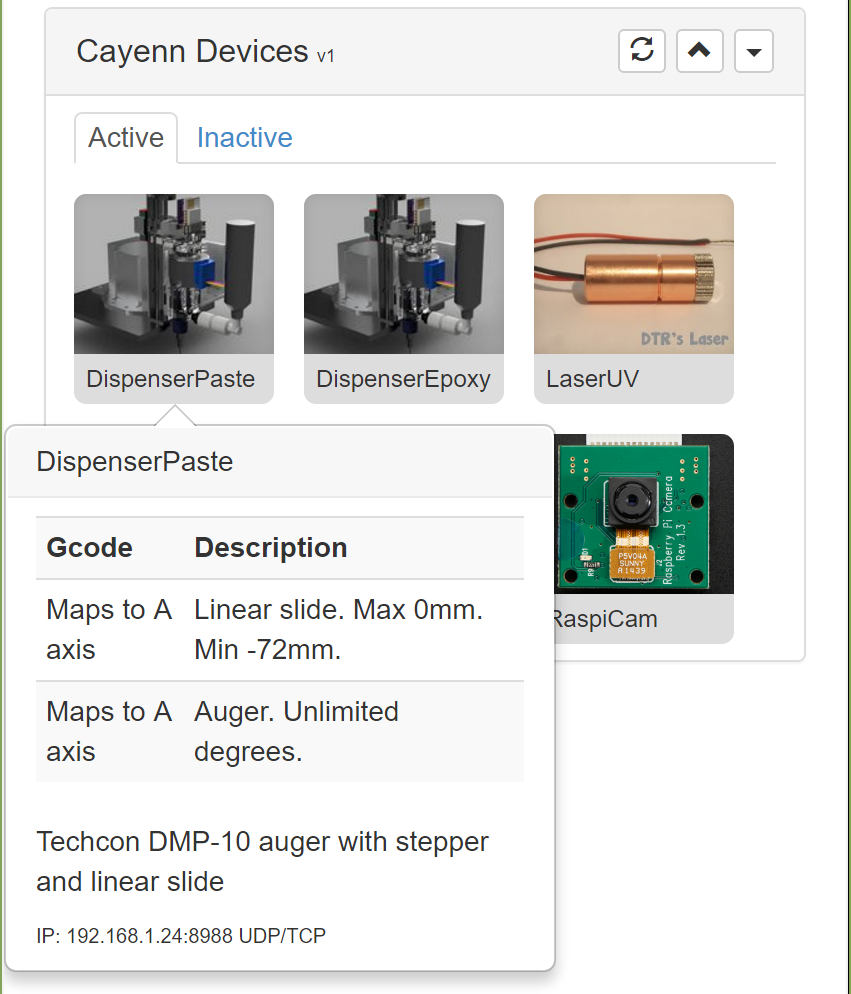

# com-chilipeppr-widget-cayenn
This widget shows you icons for all of your Cayenn devices which are IoT devices that can announce their existence to ChiliPeppr via Serial Port JSON Server. When they announce their existence this widget sees it and shows you an icon so you can interact with each respective widget for the Cayenn device.



## ChiliPeppr Widget / Cayenn

All ChiliPeppr widgets/elements are defined using cpdefine() which is a method
that mimics require.js. Each defined object must have a unique ID so it does
not conflict with other ChiliPeppr widgets.

| Item                  | Value           |
| -------------         | ------------- | 
| ID                    | com-chilipeppr-widget-cayenn |
| Name                  | Widget / Cayenn |
| Description           | This widget shows you icons for all of your Cayenn devices which are IoT devices that can announce their existence to ChiliPeppr via Serial Port JSON Server. When they announce their existence this widget sees it and shows you an icon so you can interact with each respective widget for the Cayenn device. |
| chilipeppr.load() URL | http://raw.githubusercontent.com/chilipeppr/widget-cayenn/master/auto-generated-widget.html |
| Edit URL              | http://ide.c9.io/chilipeppr/widget-cayenn |
| Github URL            | http://github.com/chilipeppr/widget-cayenn |
| Test URL              | https://preview.c9users.io/chilipeppr/widget-cayenn/widget.html |

## Example Code for chilipeppr.load() Statement

You can use the code below as a starting point for instantiating this widget 
inside a workspace or from another widget. The key is that you need to load 
your widget inlined into a div so the DOM can parse your HTML, CSS, and 
Javascript. Then you use cprequire() to find your widget's Javascript and get 
back the instance of it.

```javascript
// Inject new div to contain widget or use an existing div with an ID
$("body").append('<' + 'div id="myDivWidgetCayenn"><' + '/div>');

chilipeppr.load(
  "#myDivWidgetCayenn",
  "http://raw.githubusercontent.com/chilipeppr/widget-cayenn/master/auto-generated-widget.html",
  function() {
    // Callback after widget loaded into #myDivWidgetCayenn
    // Now use require.js to get reference to instantiated widget
    cprequire(
      ["inline:com-chilipeppr-widget-cayenn"], // the id you gave your widget
      function(myObjWidgetCayenn) {
        // Callback that is passed reference to the newly loaded widget
        console.log("Widget / Cayenn just got loaded.", myObjWidgetCayenn);
        myObjWidgetCayenn.init();
      }
    );
  }
);

```

## Publish

This widget/element publishes the following signals. These signals are owned by this widget/element and are published to all objects inside the ChiliPeppr environment that listen to them via the 
chilipeppr.subscribe(signal, callback) method. 
To better understand how ChiliPeppr's subscribe() method works see amplify.js's documentation at http://amplifyjs.com/api/pubsub/

  <table id="com-chilipeppr-elem-pubsubviewer-pub" class="table table-bordered table-striped">
      <thead>
          <tr>
              <th style="">Signal</th>
              <th style="">Description</th>
          </tr>
      </thead>
      <tbody>
      <tr valign="top"><td>/com-chilipeppr-widget-cayenn/onExampleGenerate</td><td>Example: Publish this signal when we go to generate gcode.</td></tr>    
      </tbody>
  </table>

## Subscribe

This widget/element subscribes to the following signals. These signals are owned by this widget/element. Other objects inside the ChiliPeppr environment can publish to these signals via the chilipeppr.publish(signal, data) method. 
To better understand how ChiliPeppr's publish() method works see amplify.js's documentation at http://amplifyjs.com/api/pubsub/

  <table id="com-chilipeppr-elem-pubsubviewer-sub" class="table table-bordered table-striped">
      <thead>
          <tr>
              <th style="">Signal</th>
              <th style="">Description</th>
          </tr>
      </thead>
      <tbody>
      <tr><td colspan="2">(No signals defined in this widget/element)</td></tr>    
      </tbody>
  </table>

## Foreign Publish

This widget/element publishes to the following signals that are owned by other objects. 
To better understand how ChiliPeppr's subscribe() method works see amplify.js's documentation at http://amplifyjs.com/api/pubsub/

  <table id="com-chilipeppr-elem-pubsubviewer-foreignpub" class="table table-bordered table-striped">
      <thead>
          <tr>
              <th style="">Signal</th>
              <th style="">Description</th>
          </tr>
      </thead>
      <tbody>
      <tr><td colspan="2">(No signals defined in this widget/element)</td></tr>    
      </tbody>
  </table>

## Foreign Subscribe

This widget/element publishes to the following signals that are owned by other objects.
To better understand how ChiliPeppr's publish() method works see amplify.js's documentation at http://amplifyjs.com/api/pubsub/

  <table id="com-chilipeppr-elem-pubsubviewer-foreignsub" class="table table-bordered table-striped">
      <thead>
          <tr>
              <th style="">Signal</th>
              <th style="">Description</th>
          </tr>
      </thead>
      <tbody>
      <tr valign="top"><td>/com-chilipeppr-widget-cayenn/com-chilipeppr-widget-serialport/onAnnounce</td><td>We subscribe to this signal so we can hear about announcements of devices from SPJS.</td></tr><tr valign="top"><td>/com-chilipeppr-widget-cayenn/com-chilipeppr-widget-gcode//onplay</td><td>We subscribe to this signal so we can interrupt the start of the Gcode run and send ResetCtr commands to all Cayenn devices listed in the Gcode.</td></tr>    
      </tbody>
  </table>

## Methods / Properties

The table below shows, in order, the methods and properties inside the widget/element.

  <table id="com-chilipeppr-elem-methodsprops" class="table table-bordered table-striped">
      <thead>
          <tr>
              <th style="">Method / Property</th>
              <th>Type</th>
              <th style="">Description</th>
          </tr>
      </thead>
      <tbody>
      <tr valign="top"><td>id</td><td>string</td><td>"com-chilipeppr-widget-cayenn"<br><br>The ID of the widget. You must define this and make it unique.</td></tr><tr valign="top"><td>name</td><td>string</td><td>"Widget / Cayenn"</td></tr><tr valign="top"><td>desc</td><td>string</td><td>"This widget shows you icons for all of your Cayenn devices which are IoT devices that can announce their existence to ChiliPeppr via Serial Port JSON Server. When they announce their existence this widget sees it and shows you an icon so you can interact with each respective widget for the Cayenn device."</td></tr><tr valign="top"><td>url</td><td>string</td><td>"http://raw.githubusercontent.com/chilipeppr/widget-cayenn/master/auto-generated-widget.html"</td></tr><tr valign="top"><td>fiddleurl</td><td>string</td><td>"http://ide.c9.io/chilipeppr/widget-cayenn"</td></tr><tr valign="top"><td>githuburl</td><td>string</td><td>"http://github.com/chilipeppr/widget-cayenn"</td></tr><tr valign="top"><td>testurl</td><td>string</td><td>"http://widget-cayenn-chilipeppr.c9users.io/widget.html"</td></tr><tr valign="top"><td>publish</td><td>object</td><td>Please see docs above.<br><br>Define the publish signals that this widget/element owns or defines so that
other widgets know how to subscribe to them and what they do.</td></tr><tr valign="top"><td>subscribe</td><td>object</td><td>Please see docs above.<br><br>Define the subscribe signals that this widget/element owns or defines so that
other widgets know how to subscribe to them and what they do.</td></tr><tr valign="top"><td>foreignPublish</td><td>object</td><td>Please see docs above.<br><br>Document the foreign publish signals, i.e. signals owned by other widgets
or elements, that this widget/element publishes to.</td></tr><tr valign="top"><td>foreignSubscribe</td><td>object</td><td>Please see docs above.<br><br>Document the foreign subscribe signals, i.e. signals owned by other widgets
or elements, that this widget/element subscribes to.</td></tr><tr valign="top"><td>init</td><td>function</td><td>function () <br><br>All widgets should have an init method. It should be run by the
instantiating code like a workspace or a different widget.</td></tr><tr valign="top"><td>setupOnPlayResetCtr</td><td>function</td><td>function () <br><br>We watch the play button and make sure we send a ResetCtr for all devices that
are in this Gcode file.</td></tr><tr valign="top"><td>isWaitingForLoopbackPlay</td><td>boolean</td><td></td></tr><tr valign="top"><td>onPlay</td><td>function</td><td>function (payload) <br><br>We get called here when we see the /onPlay pubsub signal. This means we have to make sure everything is safe to run, i.e.
1) We have a Cayenn Gcode file and it matches with our devices
2) We have uploaded everything to the devices
3) We have sent ResetCtr's to all devices so they sync correctly</td></tr><tr valign="top"><td>setupDragDropIntercept</td><td>function</td><td>function () <br><br>We need to watch drag drop events of files to see if they contain
Cayenn commands. If so, we need to modify those to coolant on/off commands
and make sure they're mapped to real Cayenn devices.</td></tr><tr valign="top"><td>resendGcodeToWorkspace</td><td>function</td><td>function () </td></tr><tr valign="top"><td>file</td><td>object</td><td></td></tr><tr valign="top"><td>fileLines</td><td>object</td><td></td></tr><tr valign="top"><td>fileInfo</td><td>object</td><td></td></tr><tr valign="top"><td>onFileLoaded</td><td>function</td><td>function (txt, info, skipLocalStore) </td></tr><tr valign="top"><td>showModal</td><td>function</td><td>function () <br><br>Show Process It Modal.
For now, try just bypassing this since we have other dialog boxes that sort of handle this now.</td></tr><tr valign="top"><td>processFile</td><td>function</td><td>function () </td></tr><tr valign="top"><td>showErrorModal</td><td>function</td><td>function (errArr) </td></tr><tr valign="top"><td>showNoDeviceErrorModal</td><td>function</td><td>function (errTxt) </td></tr><tr valign="top"><td>currentGcodeFileDevices</td><td>object</td><td></td></tr><tr valign="top"><td>cmdUploadQueue</td><td>object</td><td>Build a queue first of the commands we will send.</td></tr><tr valign="top"><td>uploadCmdsToCayennDevice</td><td>function</td><td>function (devices) <br><br>This method lets you upload a list of commands to a device. Simply
provide the device name and the commands and we will upload it.
Pass in:
{ "Laser6W":
[{Cmd:"LaserOn",Id:0}, {Cmd:"LaserOff",Id:1}],
"Air":
[{Cmd:"AirOn",Id:2}]
}</td></tr><tr valign="top"><td>setupUpload</td><td>function</td><td>function () <br><br>Setup header of widget to allow clicking the progress bar to see full dialog.</td></tr><tr valign="top"><td>doUpload</td><td>function</td><td>function () <br><br>In this method, we prep for the uploading. We setup the UI to show the progress, prep
the upload queue, and then start the async sending queue.</td></tr><tr valign="top"><td>isCurrentlyUploading</td><td>boolean</td><td></td></tr><tr valign="top"><td>startUploading</td><td>function</td><td>function () <br><br>This method slowly uploads commands. TODO watch that they're all done.</td></tr><tr valign="top"><td>isDidUploadNextCmdSendSomething</td><td>boolean</td><td></td></tr><tr valign="top"><td>doUploadNextCmd</td><td>function</td><td>function () <br><br>This method finds the next queue item needing sent to Cayenn device, sends it, and updates
the UI as it does it. This can be called asynchronously so that lots of UI processing
and waiting can occur to verify the upload.</td></tr><tr valign="top"><td>iconsClear</td><td>function</td><td>function () </td></tr><tr valign="top"><td>iconGet</td><td>function</td><td>function (device) </td></tr><tr valign="top"><td>setupRefreshBtn</td><td>function</td><td>function () </td></tr><tr valign="top"><td>sendRefreshCmd</td><td>function</td><td>function () </td></tr><tr valign="top"><td>getSubnetBroadcast</td><td>function</td><td>function (callback) </td></tr><tr valign="top"><td>setupOnAnnounceSubscribe</td><td>function</td><td>function () </td></tr><tr valign="top"><td>getDeviceIdFromDeviceName</td><td>function</td><td>function (name) <br><br>Loop thru all device id's and see if the device name matches. If multiple
device id's exist for a name, the UI will have to prompt user for which exact device id
should be used.</td></tr><tr valign="top"><td>getAllDeviceNames</td><td>function</td><td>function () <br><br>Will loop thru all devices and grab the names and return those in an array.</td></tr><tr valign="top"><td>cayennDevices</td><td>object</td><td></td></tr><tr valign="top"><td>cayennDeviceIdShowing</td><td>object</td><td></td></tr><tr valign="top"><td>onAnnounce</td><td>function</td><td>function (payload) </td></tr><tr valign="top"><td>lastTransactionId</td><td>number</td><td>Keep track of each transaction id because Cayenn devices will regurgitate the response with this id.</td></tr><tr valign="top"><td>sendCmd</td><td>function</td><td>function (deviceid, maincmd, subcmd) </td></tr><tr valign="top"><td>onIncomingCmd</td><td>function</td><td>function (deviceid, cmd) </td></tr><tr valign="top"><td>lastQueueItems</td><td>object</td><td></td></tr><tr valign="top"><td>updateQueueForDevice</td><td>function</td><td>function (payload) </td></tr><tr valign="top"><td>updateCmdsForDevice</td><td>function</td><td>function (payload) </td></tr><tr valign="top"><td>onCmdBtn</td><td>function</td><td>function (evt) </td></tr><tr valign="top"><td>showOneDevice</td><td>function</td><td>function (evt) </td></tr><tr valign="top"><td>cmdHistory</td><td>object</td><td></td></tr><tr valign="top"><td>cmdHistoryLastIndex</td><td>number</td><td></td></tr><tr valign="top"><td>onKeyUp</td><td>function</td><td>function (evt) </td></tr><tr valign="top"><td>showIconList</td><td>function</td><td>function () </td></tr><tr valign="top"><td>loader</td><td>object</td><td>Send a command to the Cayenn device. 
sendCmd: function(deviceid, maincmd, subcmd)
You must pass in a deviceid. The maincmd is send-tcp or send-udp
The subcmd is the Cayenn cmd like {"Cmd":"LaserOn"}
/
sendCmd: function(deviceid, maincmd, subcmd) {
// here we send a command and store a history of it in the log
var cmd = maincmd + " " + subcmd;
// remove newline
cmd = cmd.replace(/\n$/, "");
// if (! cmd.endsWith("\n")) cmd += "\n";
console.log("sending command for deviceid:", deviceid, " cmd:", cmd);
chilipeppr.publish("/com-chilipeppr-widget-serialport/ws/send", cmd);<br><br>// see if history of log
var device = this.cayennDevices[deviceid];
if (!('log' in device)) device.log = [];<br><br>var entry = {ts:new Date(), maincmd: maincmd, subcmd: subcmd, dir:"out"};<br><br>device.log.unshift(entry);<br><br>// if view for this device is showing, shove it in log view
if (this.cayennDeviceIdShowing == deviceid) {
var logEl = $('#' + this.id + ' .cayenn-log');
var entryEl = $('<tr><td>> ' + entry.ts.toLocaleTimeString() + '</td><td>' + subcmd + '</td></tr>');
logEl.prepend(entryEl);
}
},
onIncomingCmd: function(deviceid, cmd) {
console.log("onIncomingCmd. deviceid:", deviceid, "cmd:", cmd);<br><br>if (deviceid != null && deviceid.length > 0) {
var entry = {ts:new Date(), subcmd: cmd, dir:"in"};<br><br>var device = this.cayennDevices[deviceid];
if (!('log' in device)) device.log = [];<br><br>device.log.unshift(entry);<br><br>// if view for this device is showing, shove it in log view
if (this.cayennDeviceIdShowing == deviceid) {
var logEl = $('#' + this.id + ' .cayenn-log');
var entryEl = $('<tr><td>< ' + entry.ts.toLocaleTimeString() + '</td><td>' + cmd + '</td></tr>');
logEl.prepend(entryEl);
}
} else {
console.warn("got deviceid that is empty. huh?");
}
},
lastQueueItems: null,
updateQueueForDevice: function(payload) {
// we get this call when we get back a list of queued commands from the device
console.log("updateQueueForDevice. payload:", payload);<br><br>
// tag looks good. populate cmd list
var el = $('#' + this.id + ' .cayenn-onedevice');
var qListEl = el.find('.cayenn-qlist');<br><br>// check we have good data
// we can get back 
// {"Finish":47,"Resp":"GetQ"}
// {"Q":{"Cmd":"LaserShutdown","Id":46},"Resp":"GetQ"}
// {"Start":0,"Resp":"GetQ"}<br><br>// which just means it's done sending us it's list
if ('Tag' in payload && 'Resp' in payload.Tag && payload.Tag.Resp == "GetQ") {<br><br>// then we are getting responses for the GetQ command
if ('Finish' in payload.Tag) {<br><br>// we are finished with list
console.log("done getting queue items");<br><br>if (this.lastQueueItems.length == 0) {
var htmlEl = $('<tr><td>' + "Queue is empty. " + new Date().toLocaleTimeString() + '</td></tr>');
qListEl.prepend(htmlEl);
} else {
var htmlEl = $('<tr><td colspan=2>' + "Done getting queue at " + new Date().toLocaleTimeString() + '</td></tr>');
qListEl.prepend(htmlEl);
}<br><br>
} else if ('Start' in payload.Tag) {<br><br>// we are starting with list
// wipe list
qListEl.html("");
this.lastQueueItems = [];<br><br>} else if ('Q' in payload.Tag) {<br><br>// we are getting an individual item
console.log("we have a queue item. payload:", payload);<br><br>this.lastQueueItems.push(payload);<br><br>var htmlEl = $('<tr><td>' + payload.Tag.Q.Id + '</td><td>' + JSON.stringify(payload.Tag.Q) + '</td></tr>');
qListEl.append(htmlEl);<br><br>// var keys = Object.keys(payload.Tag.Queue);<br><br>// if (keys.length == 0) {
//     var htmlEl = $('<tr><td>' + "Queue is empty. " + new Date().toLocaleTimeString() + '</td></tr>');
//     qListEl.append(htmlEl);
// }<br><br>
// console.log("keys.length:", keys.length);
// for (var i = 0; i < keys.length; i++) {
//     var key = keys[i];
//     var q = payload.Tag.Queue[key];
//     console.log("q:", q);
//     var htmlEl = $('<tr><td>' + key + '</td><td>' + JSON.stringify(q) + '</td></tr>');
//     // htmlEl.click({DeviceId:payload.DeviceId, Cmd:cmd}, this.onCmdBtn.bind(this));
//     qListEl.append(htmlEl);
// }
}<br><br>} else {
console.error("Does not look like we got a good Tag list for response to GetCmds. payload:", payload);
}<br><br>},
updateCmdsForDevice: function(payload) {
// we get this call when we get back a list of commands from the device
console.log("updateCmdsForDevice. payload:", payload);<br><br>// check we have good data
if ('Tag' in payload && 'Resp' in payload.Tag && 'Cmds' in payload.Tag) {<br><br>// tag looks good. populate cmd list
var el = $('#' + this.id + ' .cayenn-onedevice');
var cmdListEl = el.find('.cayenn-cmdlist');
cmdListEl.html("");
for (var i = 0; i < payload.Tag.Cmds.length; i++) {
var cmd = payload.Tag.Cmds[i];
var htmlEl = $('<button class="btn btn-xs btn-default">' + cmd + '</button>');
htmlEl.click({DeviceId:payload.DeviceId, Cmd:cmd}, this.onCmdBtn.bind(this));
cmdListEl.append(htmlEl);
}<br><br>// also populate the cmd pulldown in log tab
var cmdListDd = el.find('.dropdown-menu-cayenn-cmds');
cmdListDd.html(""); // wipe pulldown
for (var i = 0; i < payload.Tag.Cmds.length; i++) {
var cmd = payload.Tag.Cmds[i];
var htmlEl = $('<li><a href="javascript:">' + cmd + '</a></li>');
htmlEl.click({DeviceId:payload.DeviceId, Cmd:cmd}, this.onCmdBtn.bind(this));
cmdListDd.append(htmlEl);
}<br><br>// make it so on click the button / menu go abs positioning
var dd = el.find('.dropdown-cayenn-cmds');
var tbl = el.find('.cayenn-log');
dd.off(); 
dd.on('show.bs.dropdown', function () {
dd.addClass('dropdown-cayenn-cmds-abs');
tbl.addClass('table-when-dropdown');
});
dd.on('hide.bs.dropdown', function () {
dd.removeClass('dropdown-cayenn-cmds-abs');
tbl.removeClass('table-when-dropdown');
});<br><br>} else {
console.error("Does not look like we got a good Tag list for response to GetCmds. payload:", payload);
}<br><br>},
onCmdBtn: function(evt) {<br><br>// see if the cmd has parentheses cuz that can't be used directly
var cmd = evt.data.Cmd;<br><br>if (cmd == "CmdQ") {
// special command we know of so we handle it with parameters
var obj = {
Cmd: "CmdQ",
Id: 0,
RunCmd: {
Cmd: "(cmd-here)"
}
}
obj.TransId = this.lastTransactionId++;
console.log("obj:", obj);<br><br>var subcmd = JSON.stringify(obj);
console.log("subcmd:", subcmd);<br><br>// place in text area
$('#' + this.id + ' .cayenn-entercmd').val(subcmd);<br><br>} else if (cmd.match(/(.*){(.*)}/)) {
// place in text input area instead
console.log("need to place in text area. re:", RegExp.$1, RegExp.$2, "cmd:", cmd);<br><br>var obj = {
Cmd: RegExp.$1.trim(),
}<br><br>// get elements inside json
var params = RegExp.$2;
console.log("params:", params);
// split params on comma
var p = params.split(/,/);
console.log("p:", p);
for (var i = 0; i < p.length; i++) {
var item = p[i];
obj[item] = 0;
}<br><br>// var obj = JSON.parse(json);
obj.TransId = this.lastTransactionId++;
console.log("obj:", obj);
var subcmd = JSON.stringify(obj);
console.log("subcmd:", subcmd);<br><br>// place in text area
$('#' + this.id + ' .cayenn-entercmd').val(subcmd);<br><br>} else {
// var device = this.cayennDevices[evt.data.DeviceId];
var device = this.cayennDevices[this.cayennDeviceIdShowing];
var maincmd = "cayenn-sendtcp " + device.Addr.IP;
var subcmd = '{"Cmd":"' + cmd + '", "TransId":' + this.lastTransactionId++ + '}';
this.sendCmd(device.DeviceId, maincmd, subcmd);<br><br>// do some special moves for certain commands
if (cmd == "GetQ") { 
$('#' + this.id + ' .cayenn-qlist').html("<tr><td>Asking device...</td></tr>");
} else if (cmd == "WipeQ") {
$('#' + this.id + ' .cayenn-qlist').html("<tr><td>Please run GetQ to refresh...</td></tr>");
}
}
},<br><br>showOneDevice: function(evt) {<br><br>console.log("showing one device. evt.data:", evt.data);<br><br>// what device are we dealing with
var device = this.cayennDevices[evt.data.DeviceId];<br><br>// set this as the active showing device
this.cayennDeviceIdShowing = device.DeviceId;<br><br>// hide the icon list, show the single device
$('#' + this.id + ' .cayenn-icon-list').addClass('hidden');<br><br>// change the css of the panel body
$('#' + this.id + ' .panel-body').addClass('device-showing');<br><br>var el = $('#' + this.id + ' .cayenn-onedevice');<br><br>// swap in the icon
var iconHtml = this.iconGet(device);
var iconEl = $(iconHtml);
// console.log("swapping in icon:", iconHtml);
el.find('.cayenn-icon').parent().html(iconHtml); //.replaceWith(iconEl);<br><br>// add click evt to back button
// make sure old events are removed
el.find(".cayenn-backbtn").off( "click" ).click(this.showIconList.bind(this));
el.find('.cayenn-icon').off( "click" ).click(this.showIconList.bind(this));<br><br>// wipe old cmds
el.find('.cayenn-cmdlist').html("(Asking device...)");<br><br>// wipe log area
el.find('.cayenn-log').html("");<br><br>// show it
el.removeClass('hidden');<br><br>// now ask the device to give us its commands
var maincmd = "cayenn-sendtcp " + device.Addr.IP;
var subcmd = '{"Cmd":"GetCmds", "TransId":' + this.lastTransactionId++ + '}';
this.sendCmd(device.DeviceId, maincmd, subcmd);
// chilipeppr.publish("/com-chilipeppr-widget-serialport/ws/send", cmd);<br><br>// ask for queue list (may not have one)
subcmd = '{"Cmd":"GetQ"}';
this.sendCmd(device.DeviceId, maincmd, subcmd);
// chilipeppr.publish("/com-chilipeppr-widget-serialport/ws/send", cmd);<br><br>// wipe current queue list
$('#' + this.id + ' .cayenn-qlist').html("<tr><td>Asking device...</td></tr>");<br><br>// make buttons work in queue tab
var qEl = $('#' + this.id + ' .cayenn-qlist').parent();
qEl.find('.btn-ResetCtr').off('click').click({Cmd:"ResetCtr"}, this.onCmdBtn.bind(this));
// qEl.find('.btn-GetCmds').off('click').click({Cmd:"GetCmds"}, this.onCmdBtn.bind(this));
qEl.find('.btn-GetQ').off('click').click({Cmd:"GetQ"}, this.onCmdBtn.bind(this));
qEl.find('.btn-WipeQ').off('click').click({Cmd:"WipeQ"}, this.onCmdBtn.bind(this));
qEl.find('.btn-CmdQ').off('click').click({Cmd:"CmdQ"}, this.onCmdBtn.bind(this));<br><br>// make it so the enter key works on the text input
var inputEl = $('#' + this.id + ' .cayenn-entercmd');
var that = this;
inputEl.off( "keyup" ).keyup(this.onKeyUp.bind(this));<br><br><br><br>this.activatePopovers();<br><br>},
cmdHistory: [""],
cmdHistoryLastIndex: 0,
onKeyUp: function(evt) {
console.log("got keyup on input box. evt:", evt, "evt.which", evt.which);
console.log("cmdHistory:", this.cmdHistory, this.cmdHistoryLastIndex);<br><br>var inputEl = $('#' + this.id + ' .cayenn-entercmd');<br><br>if (evt.which == 13) {
// we need to send the content from the text area
var cmd = inputEl.val();
var d = this.cayennDevices[this.cayennDeviceIdShowing];
var maincmd = "cayenn-sendtcp " + d.Addr.IP;
this.sendCmd(this.cayennDeviceIdShowing, maincmd, cmd);
inputEl.val("");<br><br>// push onto history
this.cmdHistory.unshift(cmd);
this.cmdHistoryLastIndex = 0; // reset to top<br><br>} else if (evt.which == 38) {
// up arrow
inputEl.val(this.cmdHistory[this.cmdHistoryLastIndex]);
this.cmdHistoryLastIndex++;
if (this.cmdHistoryLastIndex > this.cmdHistory.length - 1) this.cmdHistoryLastIndex = this.cmdHistory.length - 1;
} else if (evt.which == 40) {
// down arrow
this.cmdHistoryLastIndex--;
if (this.cmdHistoryLastIndex < 0) {
inputEl.val("");
this.cmdHistoryLastIndex = 0;
} else {
inputEl.val(this.cmdHistory[this.cmdHistoryLastIndex]);
}<br><br>}
},
showIconList: function() {<br><br>console.log("showing icon list");<br><br>// hide others
this.cayennDeviceIdShowing = null;<br><br>// hide the icon list, show the single device
$('#' + this.id + ' .cayenn-onedevice').addClass('hidden');
$('#' + this.id + ' #cayenn-renderarea').addClass('hidden');<br><br>// show the icon list, show the single device
$('#' + this.id + ' .cayenn-icon-list').removeClass('hidden');<br><br>// change the css of the panel body
$('#' + this.id + ' .panel-body').removeClass('device-showing');
},<br><br>/* 3D Related Methods Below</td></tr><tr valign="top"><td>camera</td><td>object</td><td></td></tr><tr valign="top"><td>scene</td><td>object</td><td></td></tr><tr valign="top"><td>renderer</td><td>object</td><td></td></tr><tr valign="top"><td>controls</td><td>object</td><td></td></tr><tr valign="top"><td>init3d</td><td>function</td><td>function () </td></tr><tr valign="top"><td>viewExtents</td><td>function</td><td>function () </td></tr><tr valign="top"><td>onScroll</td><td>function</td><td>function (evt) </td></tr><tr valign="top"><td>onMouseOrTouch</td><td>function</td><td>function (evt) </td></tr><tr valign="top"><td>render</td><td>function</td><td>function (evt) </td></tr><tr valign="top"><td>onResize</td><td>function</td><td>function (evt) </td></tr><tr valign="top"><td>activatePopovers</td><td>function</td><td>function () </td></tr><tr valign="top"><td>btnSetup</td><td>function</td><td>function () <br><br>Call this method from init to setup all the buttons when this widget
is first loaded. This basically attaches click events to your 
buttons. It also turns on all the bootstrap popovers by scanning
the entire DOM of the widget.</td></tr><tr valign="top"><td>onHelloBtnClick</td><td>function</td><td>function (evt) <br><br>onHelloBtnClick is an example of a button click event callback</td></tr><tr valign="top"><td>options</td><td>object</td><td>User options are available in this property for reference by your
methods. If any change is made on these options, please call
saveOptionsLocalStorage()</td></tr><tr valign="top"><td>setupUiFromLocalStorage</td><td>function</td><td>function () <br><br>Call this method on init to setup the UI by reading the user's
stored settings from localStorage and then adjust the UI to reflect
what the user wants.</td></tr><tr valign="top"><td>saveOptionsLocalStorage</td><td>function</td><td>function () <br><br>When a user changes a value that is stored as an option setting, you
should call this method immediately so that on next load the value
is correctly set.</td></tr><tr valign="top"><td>showBody</td><td>function</td><td>function (evt) <br><br>Show the body of the panel.
<br><br><b>evt</b> ({jquery_event})  - If you pass the event parameter in, we 
know it was clicked by the user and thus we store it for the next 
load so we can reset the user's preference. If you don't pass this 
value in we don't store the preference because it was likely code 
that sent in the param.</td></tr><tr valign="top"><td>hideBody</td><td>function</td><td>function (evt) <br><br>Hide the body of the panel.
<br><br><b>evt</b> ({jquery_event})  - If you pass the event parameter in, we 
know it was clicked by the user and thus we store it for the next 
load so we can reset the user's preference. If you don't pass this 
value in we don't store the preference because it was likely code 
that sent in the param.</td></tr><tr valign="top"><td>forkSetup</td><td>function</td><td>function () <br><br>This method loads the pubsubviewer widget which attaches to our 
upper right corner triangle menu and generates 3 menu items like
Pubsub Viewer, View Standalone, and Fork Widget. It also enables
the modal dialog that shows the documentation for this widget.<br><br>By using chilipeppr.load() we can ensure that the pubsubviewer widget
is only loaded and inlined once into the final ChiliPeppr workspace.
We are given back a reference to the instantiated singleton so its
not instantiated more than once. Then we call it's attachTo method
which creates the full pulldown menu for us and attaches the click
events.</td></tr><tr valign="top"><td>threeObj</td><td>object</td><td></td></tr>
      </tbody>
  </table>


## About ChiliPeppr

[ChiliPeppr](http://chilipeppr.com) is a hardware fiddle, meaning it is a 
website that lets you easily
create a workspace to fiddle with your hardware from software. ChiliPeppr provides
a [Serial Port JSON Server](https://github.com/johnlauer/serial-port-json-server) 
that you run locally on your computer, or remotely on another computer, to connect to 
the serial port of your hardware like an Arduino or other microcontroller.

You then create a workspace at ChiliPeppr.com that connects to your hardware 
by starting from scratch or forking somebody else's
workspace that is close to what you are after. Then you write widgets in
Javascript that interact with your hardware by forking the base template 
widget or forking another widget that
is similar to what you are trying to build.

ChiliPeppr is massively capable such that the workspaces for 
[TinyG](http://chilipeppr.com/tinyg) and [Grbl](http://chilipeppr.com/grbl) CNC 
controllers have become full-fledged CNC machine management software used by
tens of thousands.

ChiliPeppr has inspired many people in the hardware/software world to use the
browser and Javascript as the foundation for interacting with hardware. The
Arduino team in Italy caught wind of ChiliPeppr and now
ChiliPeppr's Serial Port JSON Server is the basis for the 
[Arduino's new web IDE](https://create.arduino.cc/). If the Arduino team is excited about building on top
of ChiliPeppr, what
will you build on top of it?

