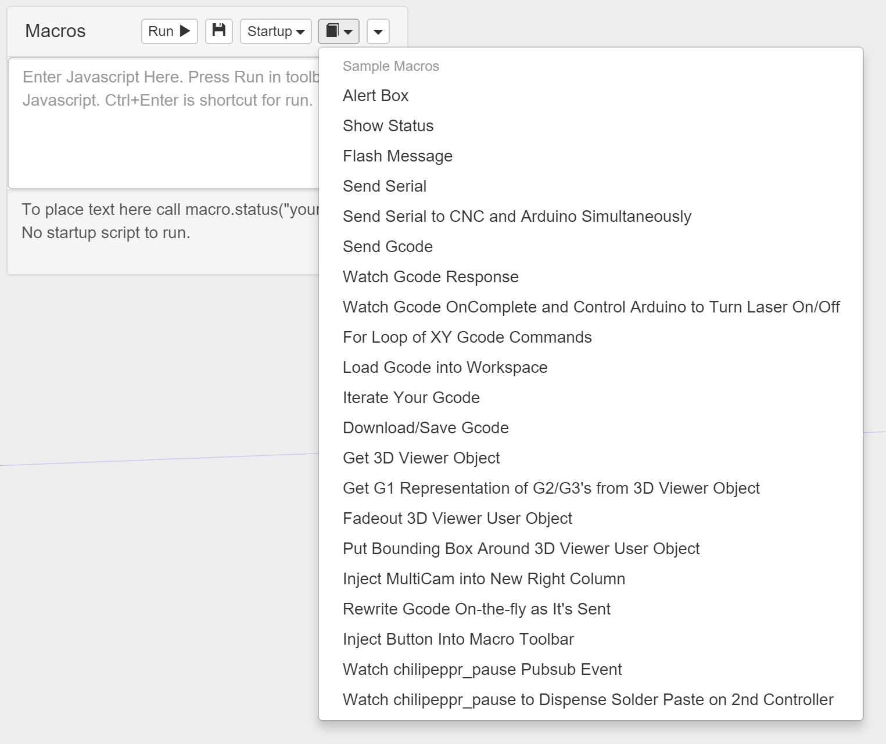

# com-chilipeppr-widget-macro
Edit and run Javascript macros inside ChiliPeppr. Lots of sample macros too.



## ChiliPeppr Widget / Macro

All ChiliPeppr widgets/elements are defined using cpdefine() which is a method
that mimics require.js. Each defined object must have a unique ID so it does
not conflict with other ChiliPeppr widgets.

| Item                  | Value           |
| -------------         | ------------- | 
| ID                    | com-chilipeppr-widget-macro |
| Name                  | Widget / Macro |
| Description           | Edit and run Javascript macros inside ChiliPeppr. Lots of sample macros too. |
| chilipeppr.load() URL | http://raw.githubusercontent.com/chilipeppr/widget-macro/master/auto-generated-widget.html |
| Edit URL              | http://ide.c9.io/chilipeppr/widget-macro |
| Github URL            | http://github.com/chilipeppr/widget-macro |
| Test URL              | https://preview.c9users.io/chilipeppr/widget-macro/widget.html |

## Example Code for chilipeppr.load() Statement

You can use the code below as a starting point for instantiating this widget 
inside a workspace or from another widget. The key is that you need to load 
your widget inlined into a div so the DOM can parse your HTML, CSS, and 
Javascript. Then you use cprequire() to find your widget's Javascript and get 
back the instance of it.

```javascript
// Inject new div to contain widget or use an existing div with an ID
$("body").append('<' + 'div id="myDivWidgetMacro"><' + '/div>');

chilipeppr.load(
  "#myDivWidgetMacro",
  "http://raw.githubusercontent.com/chilipeppr/widget-macro/master/auto-generated-widget.html",
  function() {
    // Callback after widget loaded into #myDivWidgetMacro
    // Now use require.js to get reference to instantiated widget
    cprequire(
      ["inline:com-chilipeppr-widget-macro"], // the id you gave your widget
      function(myObjWidgetMacro) {
        // Callback that is passed reference to the newly loaded widget
        console.log("Widget / Macro just got loaded.", myObjWidgetMacro);
        myObjWidgetMacro.init();
      }
    );
  }
);

```

## Publish

This widget/element publishes the following signals. These signals are owned by this widget/element and are published to all objects inside the ChiliPeppr environment that listen to them via the 
chilipeppr.subscribe(signal, callback) method. 
To better understand how ChiliPeppr's subscribe() method works see amplify.js's documentation at http://amplifyjs.com/api/pubsub/

  <table id="com-chilipeppr-elem-pubsubviewer-pub" class="table table-bordered table-striped">
      <thead>
          <tr>
              <th style="">Signal</th>
              <th style="">Description</th>
          </tr>
      </thead>
      <tbody>
      <tr><td colspan="2">(No signals defined in this widget/element)</td></tr>    
      </tbody>
  </table>

## Subscribe

This widget/element subscribes to the following signals. These signals are owned by this widget/element. Other objects inside the ChiliPeppr environment can publish to these signals via the chilipeppr.publish(signal, data) method. 
To better understand how ChiliPeppr's publish() method works see amplify.js's documentation at http://amplifyjs.com/api/pubsub/

  <table id="com-chilipeppr-elem-pubsubviewer-sub" class="table table-bordered table-striped">
      <thead>
          <tr>
              <th style="">Signal</th>
              <th style="">Description</th>
          </tr>
      </thead>
      <tbody>
      <tr><td colspan="2">(No signals defined in this widget/element)</td></tr>    
      </tbody>
  </table>

## Foreign Publish

This widget/element publishes to the following signals that are owned by other objects. 
To better understand how ChiliPeppr's subscribe() method works see amplify.js's documentation at http://amplifyjs.com/api/pubsub/

  <table id="com-chilipeppr-elem-pubsubviewer-foreignpub" class="table table-bordered table-striped">
      <thead>
          <tr>
              <th style="">Signal</th>
              <th style="">Description</th>
          </tr>
      </thead>
      <tbody>
      <tr><td colspan="2">(No signals defined in this widget/element)</td></tr>    
      </tbody>
  </table>

## Foreign Subscribe

This widget/element publishes to the following signals that are owned by other objects.
To better understand how ChiliPeppr's publish() method works see amplify.js's documentation at http://amplifyjs.com/api/pubsub/

  <table id="com-chilipeppr-elem-pubsubviewer-foreignsub" class="table table-bordered table-striped">
      <thead>
          <tr>
              <th style="">Signal</th>
              <th style="">Description</th>
          </tr>
      </thead>
      <tbody>
      <tr><td colspan="2">(No signals defined in this widget/element)</td></tr>    
      </tbody>
  </table>

## Methods / Properties

The table below shows, in order, the methods and properties inside the widget/element.

  <table id="com-chilipeppr-elem-methodsprops" class="table table-bordered table-striped">
      <thead>
          <tr>
              <th style="">Method / Property</th>
              <th>Type</th>
              <th style="">Description</th>
          </tr>
      </thead>
      <tbody>
      <tr valign="top"><td>id</td><td>string</td><td>"com-chilipeppr-widget-macro"<br><br>The ID of the widget. You must define this and make it unique.</td></tr><tr valign="top"><td>name</td><td>string</td><td>"Widget / Macro"</td></tr><tr valign="top"><td>desc</td><td>string</td><td>"Edit and run Javascript macros inside ChiliPeppr. Lots of sample macros too."</td></tr><tr valign="top"><td>url</td><td>string</td><td>"http://raw.githubusercontent.com/chilipeppr/widget-macro/master/auto-generated-widget.html"</td></tr><tr valign="top"><td>fiddleurl</td><td>string</td><td>"http://ide.c9.io/chilipeppr/widget-macro"</td></tr><tr valign="top"><td>githuburl</td><td>string</td><td>"http://github.com/chilipeppr/widget-macro"</td></tr><tr valign="top"><td>testurl</td><td>string</td><td>"http://widget-macro-chilipeppr.c9users.io/widget.html"</td></tr><tr valign="top"><td>publish</td><td>object</td><td>Please see docs above.<br><br>Define the publish signals that this widget/element owns or defines so that
other widgets know how to subscribe to them and what they do.</td></tr><tr valign="top"><td>subscribe</td><td>object</td><td>Please see docs above.<br><br>Define the subscribe signals that this widget/element owns or defines so that
other widgets know how to subscribe to them and what they do.</td></tr><tr valign="top"><td>foreignPublish</td><td>object</td><td>Please see docs above.<br><br>Document the foreign publish signals, i.e. signals owned by other widgets
or elements, that this widget/element publishes to.</td></tr><tr valign="top"><td>foreignSubscribe</td><td>object</td><td>Please see docs above.<br><br>Document the foreign subscribe signals, i.e. signals owned by other widgets
or elements, that this widget/element subscribes to.</td></tr><tr valign="top"><td>jscript</td><td>object</td><td></td></tr><tr valign="top"><td>init</td><td>function</td><td>function () </td></tr><tr valign="top"><td>setupStartup</td><td>function</td><td>function () </td></tr><tr valign="top"><td>onStartup</td><td>function</td><td>function () </td></tr><tr valign="top"><td>editStartup</td><td>function</td><td>function (evt) </td></tr><tr valign="top"><td>saveStartup</td><td>function</td><td>function (evt) </td></tr><tr valign="top"><td>makeTextareaAcceptTabs</td><td>function</td><td>function () </td></tr><tr valign="top"><td>getJscript</td><td>function</td><td>function () </td></tr><tr valign="top"><td>runMacro</td><td>function</td><td>function (macroStr, helpTxt) </td></tr><tr valign="top"><td>jscriptKeypress</td><td>function</td><td>function (evt) </td></tr><tr valign="top"><td>showData</td><td>function</td><td>function (datatxt) </td></tr><tr valign="top"><td>saveMacro</td><td>function</td><td>function () </td></tr><tr valign="top"><td>deleteRecentFiles</td><td>function</td><td>function () </td></tr><tr valign="top"><td>createRecentFileEntry</td><td>function</td><td>function (fileStr, info) </td></tr><tr valign="top"><td>buildRecentFileMenu</td><td>function</td><td>function () </td></tr><tr valign="top"><td>loadFileFromLocalStorageKey</td><td>function</td><td>function (key) </td></tr><tr valign="top"><td>loadJscript</td><td>function</td><td>function (txt) </td></tr><tr valign="top"><td>setupSamples</td><td>function</td><td>function () </td></tr><tr valign="top"><td>getMethodString</td><td>function</td><td>function (methodToGet) </td></tr><tr valign="top"><td>autoAddMacros</td><td>object</td><td></td></tr><tr valign="top"><td>makeFeedholdBtnHuge</td><td>function</td><td>function () <br><br>This macro helps you generate a zig zag tool
path inside of an overall rectangular shape. 
Give it the width and height of the rectangular
shape. Then give it the step over value and it 
will generate the gcode and then send it to the 
workspace so you can visualize it and run it.<br><br>This can be used to mill out or pocket a work
piece. It can also be used to scan a laser
over a surface to ablate or cure material
by scanning back and forth with a step over.</td></tr><tr valign="top"><td>turnOffAllPopovers</td><td>function</td><td>function () </td></tr><tr valign="top"><td>makeAllButtonsBig</td><td>function</td><td>function () </td></tr><tr valign="top"><td>generateZigZag</td><td>function</td><td>function () </td></tr><tr valign="top"><td>watchChiliPepprPauseSolderDispenser</td><td>function</td><td>function () <br><br>This macro shows how to watch for the chilipeppr
pause sync event that is triggered if you include
a comment in your gcode file like 
(chilipeppr_pause) or ; chilipeppr_pause
And then it sends commands to a 2nd CNC controller
to actually dispense solder paste<br><br>Here is a sample gcode file that uses chilipeppr_pause
<pre>G0 X0 Y0 Z0<br>
F50<br>
G1 X10<br>
(chilipeppr_pause trigger laser on)<br>
G1 X20<br>
(chilipeppr_pause trigger laser off)<br>
G0 X0</pre></td></tr><tr valign="top"><td>watchChiliPepprPause</td><td>function</td><td>function () <br><br>This macro shows how to watch for the chilipeppr
pause sync event that is triggered if you include
a comment in your gcode file like 
(chilipeppr_pause) or ; chilipeppr_pause<br><br>Here is a sample gcode file that uses chilipeppr_pause
<pre>G0 X0 Y0 Z0<br>
F50<br>
G1 X10<br>
(chilipeppr_pause trigger laser on)<br>
G1 X20<br>
(chilipeppr_pause trigger laser off)<br>
G0 X0</pre></td></tr><tr valign="top"><td>flashMsg</td><td>function</td><td>function () <br><br>Shows how to generate a Flash Message inside ChiliPeppr, which is
a message that shows by default for 3 seconds on top of everything
and then fades out. It's a great way to get the user's attention
without you having to write more than one line of code.</td></tr><tr valign="top"><td>get3dobj</td><td>function</td><td>function () <br><br>Get the object that represents the 3D viewer. Once you have it, you
can put anything into the 3D viewer that you'd like. You can wipe
out the scene, or add to it, or adjust the properties. ChiliPeppr
uses Three.js so you can refer to the docs for Three.js to figure
out different techniques for manipulating things.</td></tr><tr valign="top"><td>get3dobjG1FromG2G3</td><td>function</td><td>function () <br><br>Convert G2/G3 arcs to G1 moves. If you are having problems with your
CNC controller converting arcs, you could actually rewrite your Gcode
to straight line moves (G1's) with this macro. Each arc gets turned
into 24 line segments.</td></tr><tr valign="top"><td>injectBtn</td><td>function</td><td>function () </td></tr><tr valign="top"><td>rewriteGcode</td><td>function</td><td>function () </td></tr><tr valign="top"><td>watchOnCompleteControlArduino</td><td>function</td><td>function () </td></tr><tr valign="top"><td>iterateGcode</td><td>function</td><td>function () </td></tr><tr valign="top"><td>injectCams</td><td>function</td><td>function () </td></tr><tr valign="top"><td>downloadGcode</td><td>function</td><td>function () </td></tr><tr valign="top"><td>sendToArduino</td><td>function</td><td>function () </td></tr><tr valign="top"><td>cmdsSentViaTimeout</td><td>function</td><td>function () </td></tr><tr valign="top"><td>addbbox</td><td>function</td><td>function () </td></tr><tr valign="top"><td>fadeout</td><td>function</td><td>function () </td></tr><tr valign="top"><td>sendGcodeToWorkspace</td><td>function</td><td>function () </td></tr><tr valign="top"><td>runTestProbe</td><td>function</td><td>function () </td></tr><tr valign="top"><td>watch</td><td>function</td><td>function () </td></tr><tr valign="top"><td>sendSerial</td><td>function</td><td>function (gcode) </td></tr><tr valign="top"><td>statEl</td><td>object</td><td></td></tr><tr valign="top"><td>status</td><td>function</td><td>function (txt) </td></tr><tr valign="top"><td>getZMinSettings</td><td>function</td><td>function (donecallback) </td></tr><tr valign="top"><td>threeDGetUserObject</td><td>function</td><td>function () </td></tr><tr valign="top"><td>threeDMakeText</td><td>function</td><td>function (vals) </td></tr><tr valign="top"><td>forkSetup</td><td>function</td><td>function () </td></tr>
      </tbody>
  </table>


## About ChiliPeppr

[ChiliPeppr](http://chilipeppr.com) is a hardware fiddle, meaning it is a 
website that lets you easily
create a workspace to fiddle with your hardware from software. ChiliPeppr provides
a [Serial Port JSON Server](https://github.com/johnlauer/serial-port-json-server) 
that you run locally on your computer, or remotely on another computer, to connect to 
the serial port of your hardware like an Arduino or other microcontroller.

You then create a workspace at ChiliPeppr.com that connects to your hardware 
by starting from scratch or forking somebody else's
workspace that is close to what you are after. Then you write widgets in
Javascript that interact with your hardware by forking the base template 
widget or forking another widget that
is similar to what you are trying to build.

ChiliPeppr is massively capable such that the workspaces for 
[TinyG](http://chilipeppr.com/tinyg) and [Grbl](http://chilipeppr.com/grbl) CNC 
controllers have become full-fledged CNC machine management software used by
tens of thousands.

ChiliPeppr has inspired many people in the hardware/software world to use the
browser and Javascript as the foundation for interacting with hardware. The
Arduino team in Italy caught wind of ChiliPeppr and now
ChiliPeppr's Serial Port JSON Server is the basis for the 
[Arduino's new web IDE](https://create.arduino.cc/). If the Arduino team is excited about building on top
of ChiliPeppr, what
will you build on top of it?

