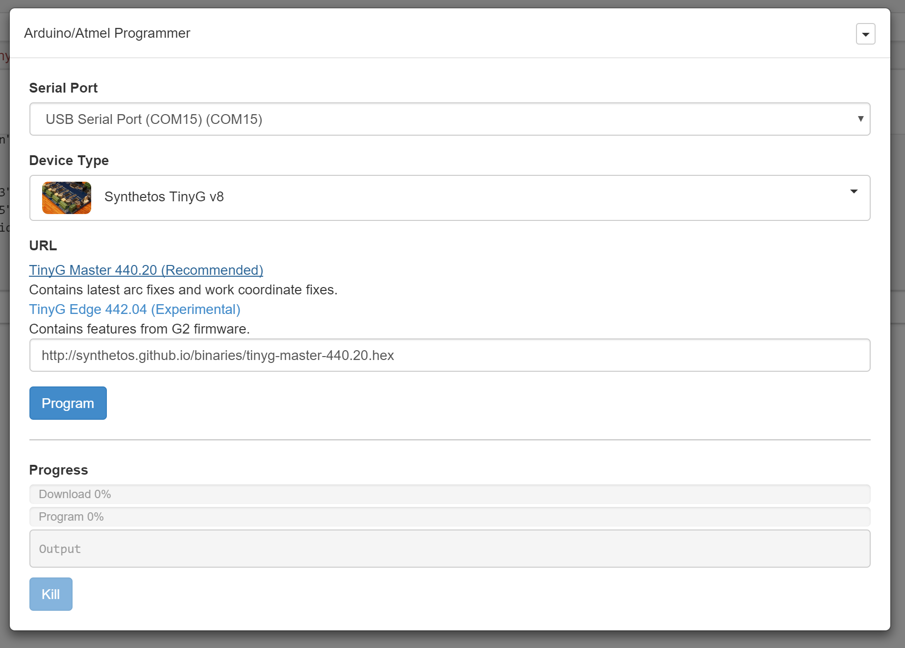

# com-chilipeppr-widget-programmer
This widget lets you program your Arduino/Atmel from within ChiliPeppr using SPJS's new programfromurl method. SPJS now comes with avrdude and bossac just like the Arduino IDE. This means SPJS can handle programming your firmware directly from the browser.



## ChiliPeppr Widget / Programmer

All ChiliPeppr widgets/elements are defined using cpdefine() which is a method
that mimics require.js. Each defined object must have a unique ID so it does
not conflict with other ChiliPeppr widgets.

| Item                  | Value           |
| -------------         | ------------- | 
| ID                    | com-chilipeppr-widget-programmer |
| Name                  | Widget / Programmer |
| Description           | This widget lets you program your Arduino/Atmel from within ChiliPeppr using SPJS's new programfromurl method. SPJS now comes with avrdude and bossac just like the Arduino IDE. This means SPJS can handle programming your firmware directly from the browser. |
| chilipeppr.load() URL | http://raw.githubusercontent.com/chilipeppr/widget-programmer/master/auto-generated-widget.html |
| Edit URL              | http://ide.c9.io/chilipeppr/widget-programmer |
| Github URL            | http://github.com/chilipeppr/widget-programmer |
| Test URL              | https://preview.c9users.io/chilipeppr/widget-programmer/widget.html |

## Example Code for chilipeppr.load() Statement

You can use the code below as a starting point for instantiating this widget 
inside a workspace or from another widget. The key is that you need to load 
your widget inlined into a div so the DOM can parse your HTML, CSS, and 
Javascript. Then you use cprequire() to find your widget's Javascript and get 
back the instance of it.

```javascript
// Inject new div to contain widget or use an existing div with an ID
$("body").append('<' + 'div id="myDivWidgetProgrammer"><' + '/div>');

chilipeppr.load(
  "#myDivWidgetProgrammer",
  "http://raw.githubusercontent.com/chilipeppr/widget-programmer/master/auto-generated-widget.html",
  function() {
    // Callback after widget loaded into #myDivWidgetProgrammer
    // Now use require.js to get reference to instantiated widget
    cprequire(
      ["inline:com-chilipeppr-widget-programmer"], // the id you gave your widget
      function(myObjWidgetProgrammer) {
        // Callback that is passed reference to the newly loaded widget
        console.log("Widget / Programmer just got loaded.", myObjWidgetProgrammer);
        myObjWidgetProgrammer.init();
      }
    );
  }
);

```

## Publish

This widget/element publishes the following signals. These signals are owned by this widget/element and are published to all objects inside the ChiliPeppr environment that listen to them via the 
chilipeppr.subscribe(signal, callback) method. 
To better understand how ChiliPeppr's subscribe() method works see amplify.js's documentation at http://amplifyjs.com/api/pubsub/

  <table id="com-chilipeppr-elem-pubsubviewer-pub" class="table table-bordered table-striped">
      <thead>
          <tr>
              <th style="">Signal</th>
              <th style="">Description</th>
          </tr>
      </thead>
      <tbody>
      <tr><td colspan="2">(No signals defined in this widget/element)</td></tr>    
      </tbody>
  </table>

## Subscribe

This widget/element subscribes to the following signals. These signals are owned by this widget/element. Other objects inside the ChiliPeppr environment can publish to these signals via the chilipeppr.publish(signal, data) method. 
To better understand how ChiliPeppr's publish() method works see amplify.js's documentation at http://amplifyjs.com/api/pubsub/

  <table id="com-chilipeppr-elem-pubsubviewer-sub" class="table table-bordered table-striped">
      <thead>
          <tr>
              <th style="">Signal</th>
              <th style="">Description</th>
          </tr>
      </thead>
      <tbody>
      <tr><td colspan="2">(No signals defined in this widget/element)</td></tr>    
      </tbody>
  </table>

## Foreign Publish

This widget/element publishes to the following signals that are owned by other objects. 
To better understand how ChiliPeppr's subscribe() method works see amplify.js's documentation at http://amplifyjs.com/api/pubsub/

  <table id="com-chilipeppr-elem-pubsubviewer-foreignpub" class="table table-bordered table-striped">
      <thead>
          <tr>
              <th style="">Signal</th>
              <th style="">Description</th>
          </tr>
      </thead>
      <tbody>
      <tr valign="top"><td>/com-chilipeppr-widget-programmer/com-chilipeppr-widget-serialport/send</td><td>We send to the serial port certain commands like the initial configuration commands for the TinyG to be in the correct mode and to get initial statuses like planner buffers and XYZ coords. We also send the Emergency Stop and Resume of ! and ~</td></tr><tr valign="top"><td>/com-chilipeppr-widget-programmer/com-chilipeppr-elem-flashmsg/flashmsg</td><td>To flash messages</td></tr>    
      </tbody>
  </table>

## Foreign Subscribe

This widget/element publishes to the following signals that are owned by other objects.
To better understand how ChiliPeppr's publish() method works see amplify.js's documentation at http://amplifyjs.com/api/pubsub/

  <table id="com-chilipeppr-elem-pubsubviewer-foreignsub" class="table table-bordered table-striped">
      <thead>
          <tr>
              <th style="">Signal</th>
              <th style="">Description</th>
          </tr>
      </thead>
      <tbody>
      <tr valign="top"><td>/com-chilipeppr-widget-programmer/com-chilipeppr-widget-serialport/recvline</td><td>When we get a dataline from serialport, process it and fire off generic CNC controller signals to the /com-chilipeppr-interface-cnccontroller channel.</td></tr>    
      </tbody>
  </table>

## Methods / Properties

The table below shows, in order, the methods and properties inside the widget/element.

  <table id="com-chilipeppr-elem-methodsprops" class="table table-bordered table-striped">
      <thead>
          <tr>
              <th style="">Method / Property</th>
              <th>Type</th>
              <th style="">Description</th>
          </tr>
      </thead>
      <tbody>
      <tr valign="top"><td>id</td><td>string</td><td>"com-chilipeppr-widget-programmer"</td></tr><tr valign="top"><td>url</td><td>string</td><td>"http://raw.githubusercontent.com/chilipeppr/widget-programmer/master/auto-generated-widget.html"</td></tr><tr valign="top"><td>fiddleurl</td><td>string</td><td>"http://ide.c9.io/chilipeppr/widget-programmer"</td></tr><tr valign="top"><td>githuburl</td><td>string</td><td>"http://github.com/chilipeppr/widget-programmer"</td></tr><tr valign="top"><td>testurl</td><td>string</td><td>"http://widget-programmer-chilipeppr.c9users.io/widget.html"</td></tr><tr valign="top"><td>name</td><td>string</td><td>"Widget / Programmer"</td></tr><tr valign="top"><td>desc</td><td>string</td><td>"This widget lets you program your Arduino/Atmel from within ChiliPeppr using SPJS's new programfromurl method. SPJS now comes with avrdude and bossac just like the Arduino IDE. This means SPJS can handle programming your firmware directly from the browser."</td></tr><tr valign="top"><td>publish</td><td>object</td><td>Please see docs above.</td></tr><tr valign="top"><td>subscribe</td><td>object</td><td>Please see docs above.</td></tr><tr valign="top"><td>foreignPublish</td><td>object</td><td>Please see docs above.</td></tr><tr valign="top"><td>foreignSubscribe</td><td>object</td><td>Please see docs above.</td></tr><tr valign="top"><td>isInitted</td><td>boolean</td><td></td></tr><tr valign="top"><td>init</td><td>function</td><td>function () </td></tr><tr valign="top"><td>setupProgramBtn</td><td>function</td><td>function () </td></tr><tr valign="top"><td>onProgram</td><td>function</td><td>function () </td></tr><tr valign="top"><td>downloadDone</td><td>boolean</td><td></td></tr><tr valign="top"><td>progressDone</td><td>boolean</td><td></td></tr><tr valign="top"><td>onWsRecv</td><td>function</td><td>function (msg) </td></tr><tr valign="top"><td>onProgramDone</td><td>function</td><td>function () </td></tr><tr valign="top"><td>portSelected</td><td>object</td><td></td></tr><tr valign="top"><td>isSetupPortListInitted</td><td>boolean</td><td></td></tr><tr valign="top"><td>setupPortList</td><td>function</td><td>function () </td></tr><tr valign="top"><td>getPortListCallback</td><td>function</td><td>function (data) </td></tr><tr valign="top"><td>onPortListClick</td><td>function</td><td>function (evt) </td></tr><tr valign="top"><td>deviceSelected</td><td>object</td><td></td></tr><tr valign="top"><td>setupDeviceList</td><td>function</td><td>function () </td></tr><tr valign="top"><td>onClickDeviceType</td><td>function</td><td>function (evt) </td></tr><tr valign="top"><td>onDeviceType</td><td>function</td><td>function (devicekey) </td></tr><tr valign="top"><td>setupUrl</td><td>function</td><td>function () </td></tr><tr valign="top"><td>setUrl</td><td>function</td><td>function (url) </td></tr><tr valign="top"><td>shortcutsClear</td><td>function</td><td>function () </td></tr><tr valign="top"><td>isVersionWarningInitted</td><td>boolean</td><td></td></tr><tr valign="top"><td>versionWarning</td><td>function</td><td>function () </td></tr><tr valign="top"><td>versionWarningCallback</td><td>function</td><td>function (spjsVersion) </td></tr><tr valign="top"><td>options</td><td>object</td><td></td></tr><tr valign="top"><td>show</td><td>function</td><td>function (options) </td></tr><tr valign="top"><td>hide</td><td>function</td><td>function () </td></tr><tr valign="top"><td>forkSetup</td><td>function</td><td>function () </td></tr><tr valign="top"><td>devices</td><td>object</td><td></td></tr>
      </tbody>
  </table>


## About ChiliPeppr

[ChiliPeppr](http://chilipeppr.com) is a hardware fiddle, meaning it is a 
website that lets you easily
create a workspace to fiddle with your hardware from software. ChiliPeppr provides
a [Serial Port JSON Server](https://github.com/johnlauer/serial-port-json-server) 
that you run locally on your computer, or remotely on another computer, to connect to 
the serial port of your hardware like an Arduino or other microcontroller.

You then create a workspace at ChiliPeppr.com that connects to your hardware 
by starting from scratch or forking somebody else's
workspace that is close to what you are after. Then you write widgets in
Javascript that interact with your hardware by forking the base template 
widget or forking another widget that
is similar to what you are trying to build.

ChiliPeppr is massively capable such that the workspaces for 
[TinyG](http://chilipeppr.com/tinyg) and [Grbl](http://chilipeppr.com/grbl) CNC 
controllers have become full-fledged CNC machine management software used by
tens of thousands.

ChiliPeppr has inspired many people in the hardware/software world to use the
browser and Javascript as the foundation for interacting with hardware. The
Arduino team in Italy caught wind of ChiliPeppr and now
ChiliPeppr's Serial Port JSON Server is the basis for the 
[Arduino's new web IDE](https://create.arduino.cc/). If the Arduino team is excited about building on top
of ChiliPeppr, what
will you build on top of it?

